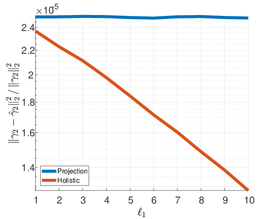
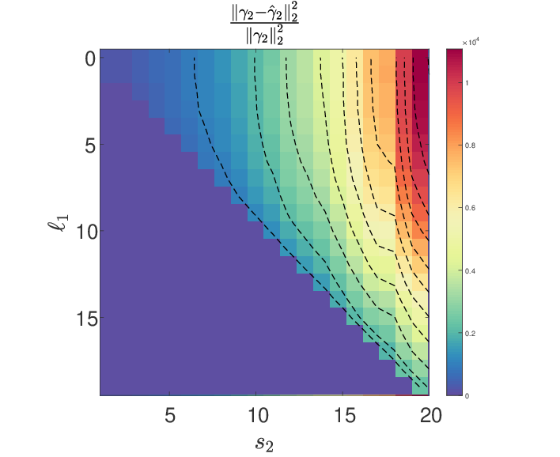

# Holistic_Pursuit
An implementation of the Holistic Pursuit for the Multi-Layer Sparse Coding model as appears in [1]. The script contains a comparison to the projection pursuit algorithm [2].

[1] - [Mutli-Layer Sparse Coding: The Holistic Way](https://arxiv.org/pdf/1804.09788.pdf). Aviad Aberdam, Jeremias Sulam, and Michael Elad. To appear in SIAM Journal on Mathematics of Data Science (SIMODS) (2018).

[2] - [Multi-Layer Convolutional Sparse Modeling: Pursuit and Dictionary Learning](https://arxiv.org/pdf/1708.08705.pdf). Jeremias Sulam, Vardan Papyan, Yaniv Romano, Michael Elad. IEEE Transactions on Signal Processing (2017).

The main file is the 'HolisticVsPursuit.m'. It contains two simulations. In the first one (set saveTrackHolistic=0) we compare the pursuit algorithms with different cocardinality of the first layer, or in simple words, with different number of zeros in the midlayer. As it can be observed in Figure 1, the Holistic Pursuit performances increase with the cocardinality of the midlayer while the projection performances don't change. This indicates that the Holistic Pursuit leverage better the information in the Multi-Layer Sparse Coding (ML-SC) model.

The second simulation (set saveTrackHolistic=1) demonstrates the importance of the midlayer constraint. The true cocardinality of the midlayer (l1) equals to the cardinality of the deepest layer (s2) minus 1. Figure 2 depict the performance of the Holistic Pursuit algorithm when it thinks that the cocardinality is smaller than the true one (y-axis).

